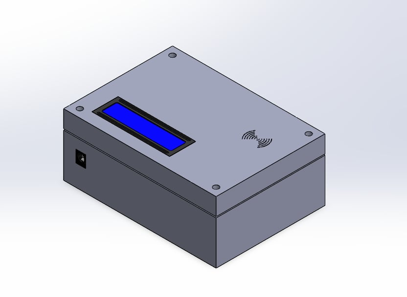
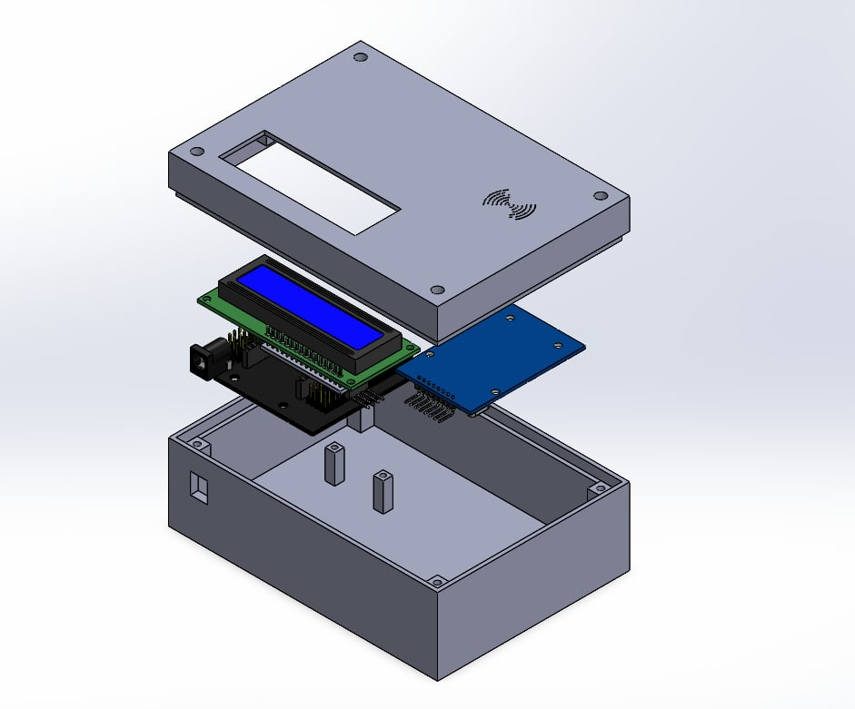
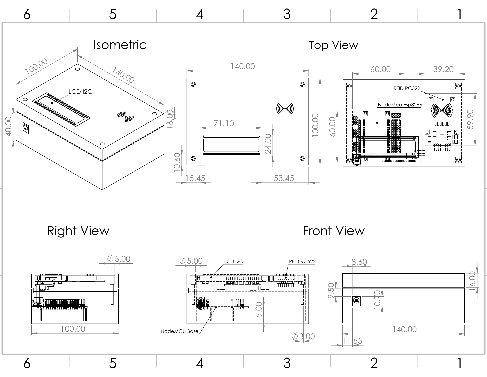

# RFID Reader — Smart Access Control System

มินิโปรเจกต์ระบบควบคุมการเข้า-ออกอัจฉริยะด้วยบัตร RFID และบันทึกประวัติการผ่านเข้า-ออก พัฒนาด้วยบอร์ดไมโครคอนโทรลเลอร์ **NodeMCU ESP8266** ร่วมกับโมดูลอ่านบัตรคลื่นความถี่วิทยุ **RFID RC522 (13.56 MHz)**, จอแสดงผล **I2C LCD 16×2**, โมดูลบันทึกข้อมูล **MicroSD Card** และการออกแบบกล่องบรรจุภัณฑ์อุปกรณ์ 3 มิติ (**3D Enclosure Design**) ด้วยโปรแกรม SolidWorks

---

## 1. การออกแบบกล่องตัวเครื่อง 3 มิติ (3D Enclosure & Mechanical Design)

โครงสร้างกล่องตัวเครื่องได้รับการออกแบบเพื่อรองรับการติดตั้งแผงวงจรและอุปกรณ์ทั้งหมดอย่างเป็นสัดส่วน โดยมีช่องเจาะพอดีสำหรับหน้าจอ LCD, พอร์ตรับไฟเลี้ยง DC Barrel Jack, และสลักยึดโมดูลอ่านบัตร RFID ใต้สัญลักษณ์รับสัญญาณ

<div align="center">
  <table>
    <tr>
      <td align="center" width="50%">
        <br>
        <b>ภาพตัวเครื่องประกอบสำเร็จ (Assembled Enclosure)</b>
      </td>
      <td align="center" width="50%">
        <br>
        <b>ภาพระเบิดชิ้นส่วนโครงสร้างภายใน (Exploded View)</b>
      </td>
    </tr>
  </table>
</div>

### แบบพิมพ์เขียววิศวกรรม (Engineering Drawing)

แบบกำหนดขนาดและมุมมองฉายมาตรฐาน (Isometric, Top View, Right View, Front View) สำหรับการขึ้นรูปชิ้นงานด้วยเครื่องพิมพ์ 3 มิติ (3D Printing) หรือการผลิตกล่องพลาสติกขึ้นรูป

<div align="center">
  
</div>

- [เปิดแบบพิมพ์เขียวฉบับ PDF](Drawing-RFID%20Reader.pdf)
- [ดาวน์โหลดไฟล์ SolidWorks (.SLDDRW)](Drawing.SLDDRW)

---

## 2. การต่อวงจรและการเชื่อมต่อฮาร์ดแวร์ (Hardware Pinout & Wiring)

ระบบประกอบด้วยอุปกรณ์หลักและพอร์ตการเชื่อมต่อดังนี้:

| อุปกรณ์ / โมดูล | บัส / สัญญาณ | ขา NodeMCU ESP8266 | หน้าที่การทำงาน |
|---|---|---|---|
| **RFID RC522** | SPI Interface | `D4` (SDA/SS), `D5` (SCK)<br>`D7` (MOSI), `D6` (MISO)<br>`D3` (RST) | อ่านข้อมูลรหัสประจำตัว (UID) จากการ์ดหรือเหรียญ RFID 13.56 MHz |
| **I2C LCD (16×2)** | I2C Bus | `D2` (SDA), `D1` (SCL) | แสดงข้อความต้อนรับ สถานะการแตะบัตร และวันเวลา |
| **MicroSD Module** | SPI Bus | `D8` (CS) | บันทึกประวัติการเข้า-ออก (Access Log) แบบออฟไลน์ |
| **Buzzer & LED** | Digital Out | ขาสัญญาณควบคุม | ส่งสัญญาณเสียงปี๊บและไฟแสดงสถานะผ่าน (สีเขียว) / ปฏิเสธ (สีแดง) |
| **DC Power Jack** | Power Supply | Vin (5V), GND | ช่องเสียบอะแดปเตอร์แปลงไฟสำหรับจ่ายระบบ |

*(สามารถดูผังการเดินสายวงจรฉบับเต็มได้ในไฟล์ [`wiring diagram.pptx`](wiring%20diagram.pptx))*

---

## 3. โครงสร้างซอฟต์แวร์และโค้ดในโปรเจกต์ (Firmware Modules)

| ไฟล์โปรแกรม (.ino) | หน้าที่และขั้นตอนการทำงาน |
|---|---|
| [`MainProject.ino`](MainProject.ino) | โปรแกรมหลักของระบบ จัดการการตรวจจับบัตร RFID, เปรียบเทียบสิทธิ์ UID ในฐานข้อมูล, ส่งข้อความแจ้งเตือนทางหน้าจอ LCD, บันทึก Log ลง MicroSD Card และเชื่อมต่อเครือข่าย Wi-Fi |
| [`AdminCard.ino`](AdminCard.ino) | โมดูลระบบจัดการสิทธิ์ผู้ใช้งานและลงทะเบียนบัตร Master / Admin Card สำหรับเพิ่มหรือลบบัตรผู้ใช้ทั่วไป |
| [`Read.ino`](Read.ino) | สคริปต์สำหรับทดสอบการสื่อสารบัส SPI และอ่านค่าเลขฐานสิบหก UID ของการ์ด RFID แต่ละใบ |

---

## 4. โครงสร้างไฟล์ใน Repository

```text
rfid-smart-access-control/
├── MainProject.ino                    # ซอร์สโค้ดระบบควบคุมการเข้า-ออกหลัก
├── AdminCard.ino                      # ซอร์สโค้ดโมดูลจัดการบัตรผู้ดูแลระบบ
├── Read.ino                           # ซอร์สโค้ดทดสอบอ่านค่า UID ของบัตร
├── Drawing-RFID Reader.pdf            # แบบพิมพ์เขียววิศวกรรมระบุขนาดกล่อง (PDF)
├── Drawing.SLDDRW                     # ไฟล์ต้นฉบับ SolidWorks Drawing
├── wiring diagram.pptx                # เอกสารผังการเดินสายไฟและวงจรอิเล็กทรอนิกส์
├── docs/
│   └── images/
│       ├── rfid-enclosure-assembled.png # ภาพเรนเดอร์ 3D ตัวเครื่องประกอบสมบูรณ์
│       ├── rfid-enclosure-exploded.png  # ภาพเรนเดอร์ 3D ระเบิดชิ้นส่วนภายใน
│       └── rfid-reader-mechanical-drawing.png # ภาพพิมพ์เขียวมุมมองวิศวกรรม
└── README.md
```
